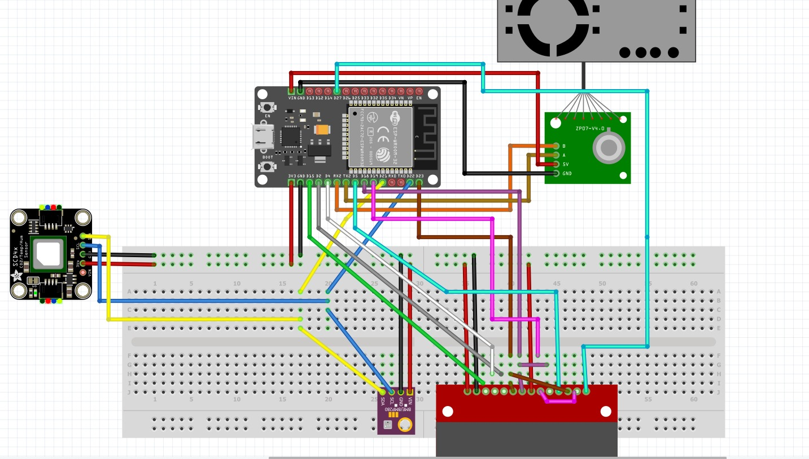
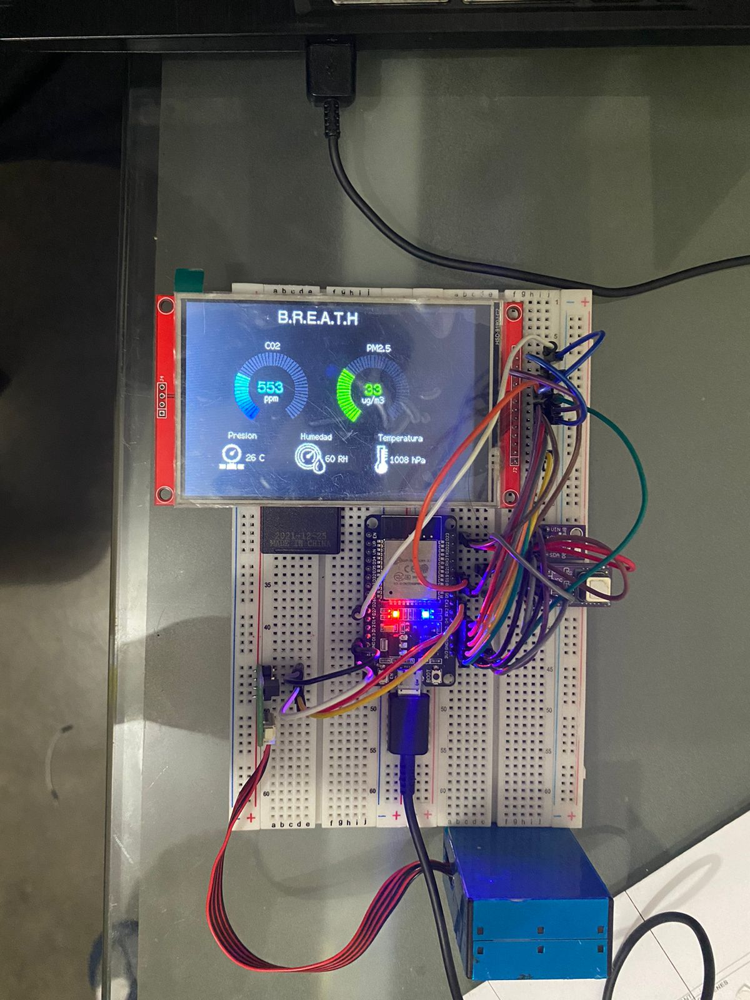

# Documentación “Breath Project”
## Introducción
Para desarrollar una ciudad inteligente es necesaria una buena calidad de aire, siendo esta fundamental para la salud y el bienestar de los ciudadanos. Los niveles altos de contaminación en el aire pueden tener efectos negativos en la salud, como problemas respiratorios, enfermedades cardiovasculares, cáncer y otras enfermedades crónicas. La propuesta Breath fue planteada para tomar medidas para reducir la contaminación del aire y mejorar la calidad de vida de los ciudadanos promoviendo el uso de energías renovables y fomentar el transporte público y la movilidad sostenible.
## Descripción
Breath es un proyecto dedicado al monitoreo de la calidad del aire, consiste en un dispositivo IOT que contiene sensores como el PMS, BME280, SCD40,  siendo capaz de hacer lecturas de la concentración de humedad, temperatura, partículas PM10, PM2.5 y diversos gases que en concentraciones altas podrían llegar a ser nocivas para el ser humano, o causar irritación y dificultades respiratorias. El proyecto se desarrolló de manera que sea escalable y compacto, debido a su bajo costo este dispositivo será capaz de desplegarse en diversos escenarios de manera que abarque lugares concurridos, instalaciones industriales e interiores, solo necesitando de una entrada de corriente y wifi, por lo que si se requiere puede llegar a ser portátil, una vez desplegado los datos serán mostrados por una pantalla LCD o si se requiere de manera virtual indicando las concentraciones mediante gráficos y guardándose los datos a la nube para su posterior uso como investigación, seguimiento y pronóstico.

## Dispositivo Breath
El objetivo del proyecto se centra en proporcionar información en tiempo real de la calidad del aire, esto surgió debido a la gran brecha de contaminación en el Perú además de la pobre concientización de esta en Lima.

### Selección de tecnología
Para la realización del proyecto contaremos con la adición de sensores además de un micronotrolador y una pantalla LCD.


<!-- TABLES -->

<table class="tg">
<thead>
  <tr>
    <th class="tg-0pky"></th>
    <th class="tg-9wq8">Módulo</th>
    <th class="tg-9wq8">Voltaje de<br>entrada</th>
    <th class="tg-9wq8">Voltaje de salida</th>
  </tr>
</thead>
<tbody>
  <tr>
    <td class="tg-0pky"></td>
    <td class="tg-9wq8">Esp32</td>
    <td class="tg-9wq8">5.5 V</td>
    <td class="tg-9wq8">3.3 V</td>
  </tr>
  <tr>
    <td class="tg-0pky"></td>
    <td class="tg-9wq8">TFT 4" LCD<br>SPI screen</td>
    <td class="tg-9wq8">3.3 V</td>
    <td class="tg-9wq8">-</td>
  </tr>
</tbody>
</table>

<table class="tg">
<thead>
  <tr>
    <th class="tg-0pky" colspan="2"></th>
    <th class="tg-9wq8">Sensor</th>
    <th class="tg-9wq8">Mediciones</th>
    <th class="tg-9wq8">Rango de medición</th>
    <th class="tg-nrix">Error</th>
    <th class="tg-nrix">Rango de voltaje</th>
  </tr>
</thead>
<tbody>
  <tr>
    <td class="tg-0lax" colspan="2" rowspan="3"></td>
    <td class="tg-nrix" rowspan="3">SCD40</td>
    <td class="tg-nrix">CO2</td>
    <td class="tg-nrix">[400, 2000] ppm</td>
    <td class="tg-nrix">± 50ppm</td>
    <td class="tg-nrix" rowspan="3">[2.4, 5.5] V</td>
  </tr>
  <tr>
    <td class="tg-nrix">Humedad<br>Relativa</td>
    <td class="tg-nrix">[0,100] %RH</td>
    <td class="tg-nrix">± 9% RH</td>
  </tr>
  <tr>
    <td class="tg-nrix">Temperatura</td>
    <td class="tg-nrix">[-10, 60]°C</td>
    <td class="tg-nrix">± 1.5°C</td>
  </tr>
  <tr>
    <td class="tg-0lax" colspan="2" rowspan="3"></td>
    <td class="tg-nrix" rowspan="3">BME280</td>
    <td class="tg-nrix">Presión<br>amtomsférica</td>
    <td class="tg-nrix">[300, 1100] hPa</td>
    <td class="tg-nrix">± 5% hPa</td>
    <td class="tg-nrix" rowspan="3">[1.71, 3.6] V</td>
  </tr>
  <tr>
    <td class="tg-9wq8">Humedad<br>Relativa</td>
    <td class="tg-9wq8">[0,100] %RH</td>
    <td class="tg-nrix">± 9% RH</td>
  </tr>
  <tr>
    <td class="tg-nrix">Temperatura</td>
    <td class="tg-nrix">[-40, 85]°C</td>
    <td class="tg-nrix">± 1.5°C</td>
  </tr>
  <tr>
    <td class="tg-0lax" colspan="2" rowspan="3"></td>
    <td class="tg-nrix" rowspan="3">PMS5003T</td>
    <td class="tg-nrix">PM 1.0</td>
    <td class="tg-nrix">[0, 1000] ug/m3</td>
    <td class="tg-nrix">± 10%ug/m3</td>
    <td class="tg-nrix" rowspan="3">[4.5, 5.5] V</td>
  </tr>
  <tr>
    <td class="tg-9wq8">PM 2.5</td>
    <td class="tg-9wq8">[0, 1000] ug/m3</td>
    <td class="tg-nrix">± 10%ug/m3</td>
  </tr>
  <tr>
    <td class="tg-9wq8">PM 10</td>
    <td class="tg-9wq8">[0, 1000] ug/m3</td>
    <td class="tg-nrix">± 10%ug/m3</td>
  </tr>
</tbody>
</table>

### Configuración y conexiones 

Esquema de conexiones entre los sensores y módulos realizados en Fritzing.



#### Conexiones TFT - ESP32
En caso de que no queramos tener la pantalla del dispositivo encendida de forma prolongada, o queramos que esta se maneje de manera rutinaria desconectar el pin LED del 3V3 del ESP32 y asignar un nuevo pin.
Tenemos que tener en cuenta que a partir de SDO(MISO) las conexiones se realizan para posterior uso del panel tactil del dispositivo (puede ser omitido).

|       4.0'' TFT     	  |   ESP32   	|
|:----------------------:	|:---------:	|
|           VCC          	|    3V3    	|
|           GND          	|    GND    	|
|           CS           	|    D15    	|
|          RESET         	|     D4    	|
|          DC/RS         	|     D2    	|
|        SDI(MOSI)       	|    D23    	|
|           SCK          	|    D18    	|
|           LED          	|    3V3    	|
|        SDO(MISO)       	|    D19    	|
|          T_CLK         	|    SCK    	|
|          T_CS          	|     D5    	|
|          T_DIN         	| SDI(MOSI) 	|
|          T_DO          	| SDO(MISO) 	|
|          T_IRQ         	|    D27    	|

#### Conexiones BME - SCD40 - ESP32
Para la configuración de nuestro dispositivo, tenemos que tener en cuenta que el módulo que utilizamos es el ESP32 DEVIKIT V1, teniendo unicamente disponibles los pines 21 y 22 como SDA y SCL respectivamente para el protocolo de comunicación I2C.


| BME280 	| SCD40 	| ESP32 	|
|:-----:	|:-----:	|:-----:	|
|  GND  	|  GND  	|   GND   |
|  VCC  	|  VCC  	|   3V3   |
|  SCL  	|   SCL  	|   22    |
|  SDA  	|   SDA  	|   21    |

Puesto a que se utiliza la comunicación I2C para ambos sensores estos se tendrán que conectar en paralelo al ESP32, por lo que si se requiere cambiar de sensor tenemos que tener en cuenta añadir su dirección como se verá a continuación.  

```c
void setup(void){
  Serial.begin(9600);
  ...
  BME280.begin(0x76); 
  SCD40.begin(0x62);
  ...
}
```

#### Conexiones PMS5003T - ESP32

Si posee una fuente adicional de 5V de preferencia conectar a esta, en lugar de la fuente de ESP32.
| PMS5003T 	|  ESP32  	|
|:--------:	|:-------:	|
|    GND   	|   GND   	|
|    VCC   	| VIN (5V) 	|
|    RX    	|   TX2   	|
|    TX    	|   RX2   	|

### Requisitos del Dispositivo:

* Conexión a Internet para comunicarse con la plataforma MQTT HiveMQ.
* Alimentación a través de conexión micro USB de 5V.
* No es resistente al agua ni debe estar sumergido.

### Comunicación:

Se utilizará la plataforma MQTT HiveMQ como broker para las comunicaciones del dispositivo.

### Despliegue
Una vez realizado las conexiones, el proyecto se reduce al ensamble de este y a la realización del código. A continuación una muestra del producto en bruto.




